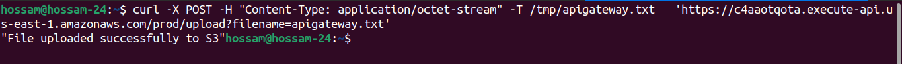
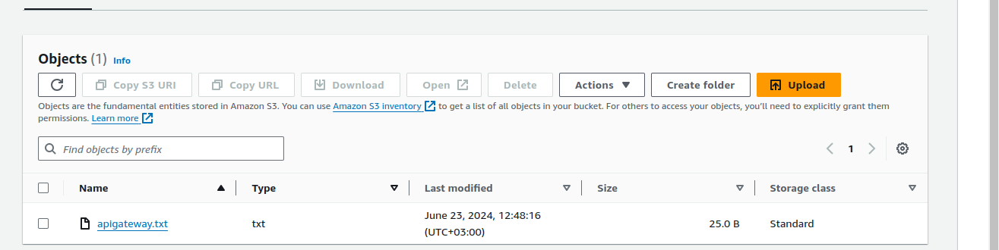

## Cloud File Storage Deployed On AWS Serverless

#### This repository contains the implementation using terraform of a file storage service using AWS API Gateway, Lambda functions, and Amazon S3, This setup allows users to upload and manage files securely on AWS infrastructure.


## Table of Contents

- [Introduction](#introduction)
- [Setup Instructions](#setup-instructions)
  - [Prerequisites](#prerequisites)
  - [Installation](#installation)
  - [Configuration](#configuration)
  - [Deployment](#deployment)
- [Usage](#usage)
- [Cleanup](#cleanup)
- [Customization](#customization)
- [Contributing](#contributing)
- [License](#license)


### Prerequisites

1. **AWS Account**: Ensure you have an AWS account with permissions to create and manage API Gateway, Lambda functions, and S3 buckets.
   
2. **AWS CLI**: Install AWS CLI to configure your AWS profile and manage resources via command line and change profile name in file _**providers.tf**_.

### Installation

Clone the repository:

```bash
git clone <repository-url>
cd <repository-name>
```


### Configuration
- Configure AWS Profile:

Open terminal or command prompt and configure AWS CLI with your AWS credentials:

```bash
aws configure --profile <your-profile-name>
```
_Follow the prompts to enter your Access Key ID, Secret Access Key, AWS Region, and output format._

### Deployment

```bash
terraform init
terraform apply
```
_Follow the prompts to enter **yes** , wait untill all resources created and then try to upload files._


### Usage

```bash
curl -X POST -H "Content-Type: application/octet-stream" -T pathtofile   'APIURL/prod/upload?filename=desiredname.extension'
```



### Cleanup
To avoid ongoing charges, delete the resources created for the demo:

```bash
terraform destroy
```
_Follow the prompts to enter **yes** and wait untill all resources deleted._

### Customization
Feel free to customize the project as per your requirements. You can modify the VPC CIDR ranges, security groups, instance types, or add additional configurations as needed.

### Contributing
Contributions to enhance or expand this project are welcome! If you find any issues or have suggestions, please open an issue or submit a pull request.

### License
This project is licensed under the MIT License.

