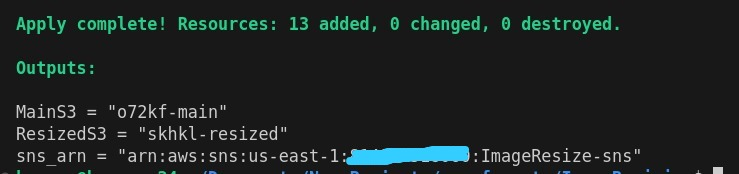
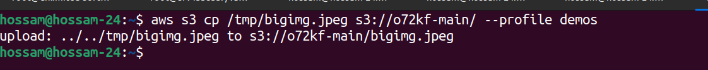
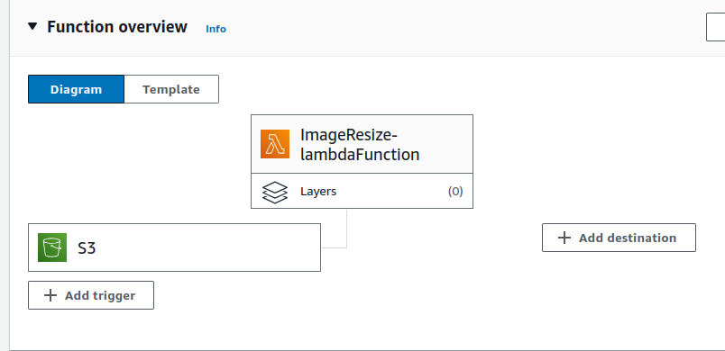
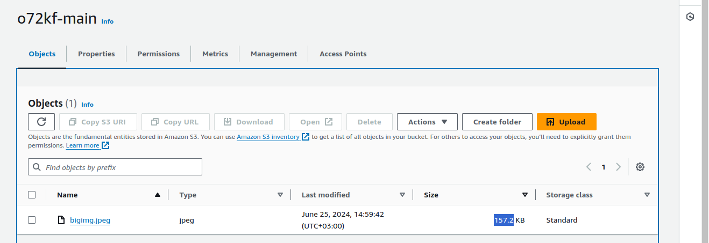
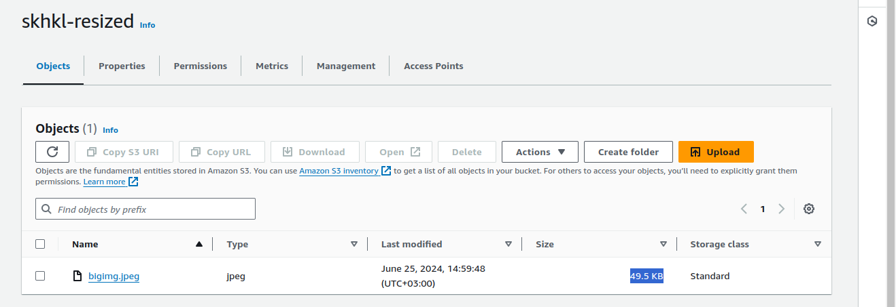

### Image Resizing Pipeline with AWS S3, Lambda, and SNS
#### This repository contains Terraform configuration files to set up an automated image resizing pipeline on AWS. The pipeline uses AWS services to resize images uploaded to an S3 bucket and notify subscribers via SNS (Simple Notification Service).


## Table of Contents

- [Introduction](#introduction)
- [Setup Instructions](#setup-instructions)
  - [Prerequisites](#prerequisites)
  - [Installation](#installation)
  - [Configuration](#configuration)
  - [Deployment](#deployment)
- [Usage](#usage)
- [Check](#check)
- [Cleanup](#cleanup)
- [Customization](#customization)
- [Contributing](#contributing)
- [License](#license)


### Prerequisites

1. **AWS Account**: Ensure you have an AWS account with permissions to create and manage API Gateway, Lambda functions, and S3 buckets.
   
2. **AWS CLI**: Install AWS CLI to configure your AWS profile and manage resources via command line and change profile name in file _**providers.tf**_.

### Installation

Clone the repository:

```bash
git clone https://github.com/hossamShawky/AWS-Terraform.git
cd AWS-Terraform/
```


### Configuration
- Configure AWS Profile:

Open terminal or command prompt and configure AWS CLI with your AWS credentials:

```bash
aws configure --profile <your-profile-name>
```
_Follow the prompts to enter your Access Key ID, Secret Access Key, AWS Region, and output format._

### Deployment

```bash
terraform init
terraform apply
```
_Follow the prompts to enter **yes** , wait untill all resources created and then try to upload files._



### Usage

```bash
aws s3 cp /tmp/bigimg.jpeg s3://o72kf-main/ --profile demos
```



### Check

*Lambda Trigger*




*Uploaded Image*



*Resized Image*




### Cleanup
To avoid ongoing charges, delete the resources created for the demo:

```bash
terraform destroy
```
_Follow the prompts to enter **yes** and wait untill all resources deleted._

### Customization
Feel free to customize the project as per your requirements. You can modify the VPC CIDR ranges, security groups, instance types, or add additional configurations as needed.

### Contributing
Contributions to enhance or expand this project are welcome! If you find any issues or have suggestions, please open an issue or submit a pull request.

### License
This project is licensed under the MIT License.

